# ASAP7-DTOP Physical Design — SHA-256
## RTL-to-Post-Route Physical Implementation using Cadence Innovus

---

## Table of Contents

1. [Introduction](#1-introduction)
2. [Project Objectives](#2-project-objectives)
3. [Design Scope](#3-design-scope)
4. [Tools and Technology](#4-tools-and-technology)
5. [Design Information](#5-design-information)
6. [Timing Constraints](#6-timing-constraints)
7. [Physical Design Flow](#7-physical-design-flow)
8. [Design Initialization](#8-design-initialization)
9. [Floorplanning](#9-floorplanning)
10. [Power Planning](#10-power-planning)
11. [Placement](#11-placement)
12. [Pre-CTS Optimization](#12-pre-cts-optimization)
13. [Clock Tree Synthesis](#13-clock-tree-synthesis)
14. [Routing](#14-routing)
15. [Post-Route Setup Timing](#15-post-route-setup-timing)
16. [Post-Route Hold Timing](#16-post-route-hold-timing)
17. [Timing Summary](#17-timing-summary)
18. [Timing Checks and Constraint Warnings](#18-timing-checks-and-constraint-warnings)
19. [Congestion Analysis](#19-congestion-analysis)
20. [Area Analysis](#20-area-analysis)
21. [Power Analysis](#21-power-analysis)
22. [Leakage Power Analysis](#22-leakage-power-analysis)
23. [Clock Power](#23-clock-power)
24. [Design Statistics](#24-design-statistics)
25. [Physical Design Stage Summary](#25-physical-design-stage-summary)
26. [Final Implementation Results](#26-final-implementation-results)
27. [Challenges and Debugging](#27-challenges-and-debugging)
28. [Tcl / Innovus Implementation](#28-tcl--innovus-implementation)
29. [Report Generation](#29-report-generation)
30. [Project Structure](#30-project-structure)
31. [Skills Demonstrated](#31-skills-demonstrated)
32. [What the Results Mean](#32-what-the-results-mean)
33. [Interview Questions](#33-interview-questions)
34. [Reproducibility](#34-reproducibility)
35. [Limitations](#35-limitations)
36. [Conclusion](#36-conclusion)

---

# 1. Introduction

This project demonstrates the physical-design implementation and analysis of a **SHA-256 cryptographic design** using the **ASAP7 technology** and **Cadence Innovus**.

The focus of the project is the ASIC backend flow rather than development of the SHA-256 algorithm itself.

The design was taken through the major physical-design stages:

```text
Design Data
    │
    ▼
Initialization / MMMC
    │
    ▼
Floorplanning + I/O Placement
    │
    ▼
Power Planning
    │
    ▼
Standard-Cell Placement
    │
    ▼
Pre-CTS Optimization
    │
    ▼
Clock Tree Synthesis
    │
    ▼
Global + Detailed Routing
    │
    ▼
Post-Route Analysis
    ├── Setup Timing
    ├── Hold Timing
    ├── Timing Checks
    ├── Congestion
    ├── Area
    └── Power
```

The project emphasizes understanding **why each physical-design stage is required**, what information is generated by the tool, and how timing, power, area and routability interact.

---

# 2. Project Objectives

The main objectives were:

- Implement the SHA-256 design using a standard ASIC physical-design flow.
- Configure the design environment and timing views.
- Define a practical floorplan.
- Place I/O pins around the design boundary.
- Build the VDD/VSS power-distribution network.
- Perform legal standard-cell placement.
- Analyze placement density and congestion.
- Optimize the design before CTS.
- Build and analyze the clock tree.
- Perform global and detailed routing.
- Analyze post-route setup timing.
- Analyze post-route hold timing.
- Generate timing summaries and timing checks.
- Analyze total and leakage power.
- Analyze cell-area statistics.
- Use Tcl to automate implementation and reporting.
- Document physical-design decisions and results.

---

# 3. Design Scope

The contribution represented by this repository is the **ASIC physical implementation and analysis** of the SHA-256 design.

The repository should not be interpreted as a claim that the SHA-256 RTL architecture itself was designed from scratch as part of this physical-design exercise.

The backend scope is:

```text
              SHA-256
                 │
                 ▼
       Gate-level implementation
                 │
                 ▼
          Physical Design
                 │
     ┌───────────┼───────────┐
     ▼           ▼           ▼
  Physical     Timing      Power
  Design       Analysis    Analysis
     │
     ▼
  Routing / Congestion
```

---

# 4. Tools and Technology

| Category | Tool / Technology |
|---|---|
| Design | SHA-256 |
| Physical Design | Cadence Innovus |
| Technology | ASAP7 |
| Standard-cell architecture | sc7p5t |
| Timing constraints | SDC |
| Scripting | Tcl |
| Operating environment | Linux |
| Supply | 0.7 V |

The project uses ASAP7 standard-cell libraries for physical implementation and timing/power estimation.

---

# 5. Design Information

## 5.1 Design Summary

| Parameter | Value |
|---|---:|
| Design | SHA-256 |
| Standard-cell instances | 8,309 |
| Reported total cell area | 20,172.655 µm² |
| Core utilization | 60.7598% |
| Supply voltage | 0.7 V |
| Clock | clk123 |
| Clock period | 600 ps |
| Target frequency | ~1.667 GHz |

---

## 5.2 Clock Frequency

The clock period is:

```text
T = 600 ps
  = 0.6 ns
```

Therefore:

```text
F = 1 / T
  = 1 / 0.6 ns
  ≈ 1.667 GHz
```

The implementation was therefore analyzed around a clock target of approximately **1.667 GHz**.

---

# 6. Timing Constraints

The design uses an SDC-based timing environment.

## Clock

```text
Clock name   : clk123
Clock period : 600 ps
Supply       : 0.7 V
```

The waveform and I/O constraints should be taken directly from the original project SDC when publishing the final repository.

A public repository should avoid inventing constraint values that were not captured from the actual run.

### Recommended SDC documentation format

```tcl
create_clock \
    -name clk123 \
    -period 600 \
    [get_ports clk]
```

The exact clock port and complete I/O constraints should match the original implementation.

---

# 7. Physical Design Flow

The complete documented flow is:

```text
                    SHA-256
                       │
                       ▼
              Design Initialization
                       │
                       ▼
                  Floorplanning
                       │
                       ▼
                 Power Planning
                       │
                       ▼
                    Placement
                       │
                       ▼
              Pre-CTS Optimization
                       │
                       ▼
              Clock Tree Synthesis
                       │
                       ▼
                    Routing
                       │
                       ▼
              Post-Route Analysis
                       │
        ┌──────────────┼──────────────┐
        ▼              ▼              ▼
      Timing         Power           Area
        │
        ├── Setup
        ├── Hold
        └── Clock / Checks
```

---

# 8. Design Initialization

Design initialization establishes the physical-design environment.

Typical initialization includes:

- Loading the gate-level netlist.
- Loading LEF technology information.
- Loading standard-cell LEFs.
- Loading Liberty timing libraries through MMMC.
- Loading timing constraints.
- Creating analysis views.
- Setting power and ground nets.
- Verifying that the design is recognized correctly.

A successful initialization is essential because later stages depend on consistent logical, physical and timing data.

### Typical verification

```tcl
# Verify top-level design
# report_design

# Check loaded timing environment
# report_analysis_view

# Check timing constraints
check_timing
```

The exact command availability depends on the Innovus release.

---

# 9. Floorplanning

Floorplanning establishes the physical boundaries of the chip and determines the available space for standard-cell placement and routing.

## 9.1 Floorplanning Objectives

The floorplan should:

- Define the die boundary.
- Define the core boundary.
- Select appropriate core utilization.
- Select an appropriate aspect ratio.
- Leave sufficient routing resources.
- Provide I/O access.
- Provide space for the power network.
- Avoid excessive density that can make routing difficult.

---

## 9.2 Floorplan Parameters

The supplied floorplan report gives:

| Parameter | Value |
|---|---:|
| Core width | 197.424 µm |
| Core height | 194.400 µm |
| Die width | 237.456 µm |
| Die height | 234.576 µm |
| Core utilization | 60.7598% |
| Core-to-left | 20.016 µm |
| Core-to-right | 20.016 µm |
| Core-to-top | 20.160 µm |
| Core-to-bottom | 20.016 µm |

The floorplan window also shows the design configured using core utilization and an aspect-ratio-based floorplan.

---

## 9.3 Floorplan with I/O Placement

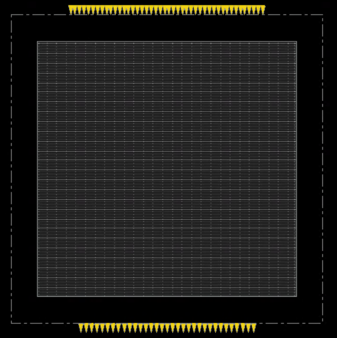

The I/O pins are distributed around the boundary of the design.

The purpose of I/O placement is to:

- Provide reasonable access to external signals.
- Reduce unnecessary routing detours.
- Avoid concentrating all pins in one region.
- Provide a practical interface between the core and package-level connections.

---

## 9.4 Floorplan Settings

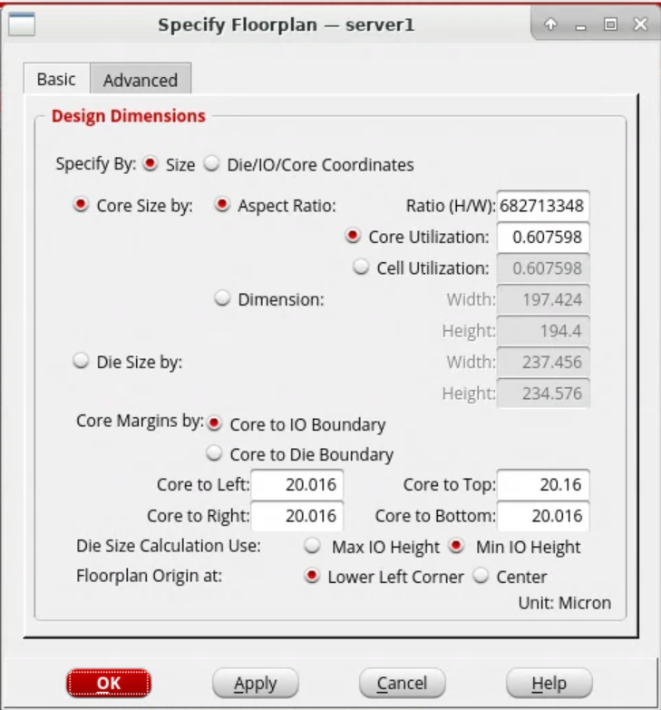

The floorplan configuration shown in the supplied screenshot uses:

```text
Core utilization ≈ 60.76%
Core width       = 197.424 µm
Core height      = 194.400 µm
Die width        = 237.456 µm
Die height       = 234.576 µm
```

---

# 10. Power Planning

Power planning creates the physical VDD/VSS distribution network.

A typical power-distribution network contains:

```text
                VDD / VSS Ring
              ┌─────────────────┐
              │ ═══════════════ │
              │ │ │ │ │ │ │ │ │ │
              │ ═══════════════ │
              │ │ │ │ CORE │ │ │
              │ ═══════════════ │
              │ │ │ │ │ │ │ │ │ │
              └─────────────────┘
```

The actual design uses the power-grid configuration created during the Innovus run.

---

## 10.1 Objectives

The power network should:

- Deliver VDD to all standard cells.
- Provide a low-resistance return path through VSS.
- Connect standard-cell rails to the global power grid.
- Provide sufficient current-carrying capacity.
- Reduce IR-drop risk.
- Reduce electromigration risk.
- Provide reliable power-via connectivity.

---

## 10.2 Power Planning View

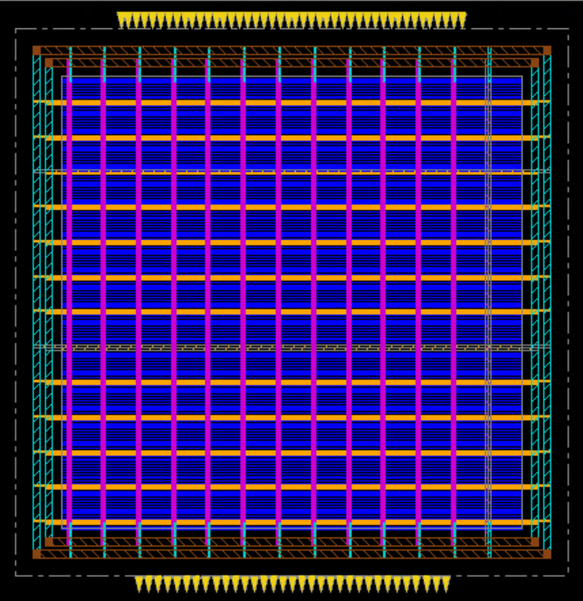

The screenshot shows the power grid over the core with horizontal and vertical metal structures.

The dense grid is expected because power planning intentionally reserves metal resources for the supply network.

---

## 10.3 Why Power Planning Happens Before Placement

Power planning is performed before final standard-cell placement because the power network establishes the physical infrastructure to which standard-cell power rails will connect.

If the PDN is poorly designed:

```text
Poor PDN
   ↓
Higher resistance
   ↓
IR drop
   ↓
Lower cell supply voltage
   ↓
Timing degradation / functional risk
```

Therefore power planning is a physical-design quality requirement, not just a visual layout step.

---

# 11. Placement

Placement determines the physical locations of standard cells within the core.

Placement quality affects:

- Wirelength.
- Timing.
- Congestion.
- Power.
- CTS feasibility.
- Routing quality.

---

## 11.1 Placement Objectives

The placement stage attempts to:

1. Achieve legal placement.
2. Reduce critical-path delay.
3. Maintain acceptable density.
4. Avoid routing hotspots.
5. Keep connected cells physically close.
6. Prepare the design for CTS.
7. Minimize unnecessary interconnect.

---

## 11.2 Placement Result

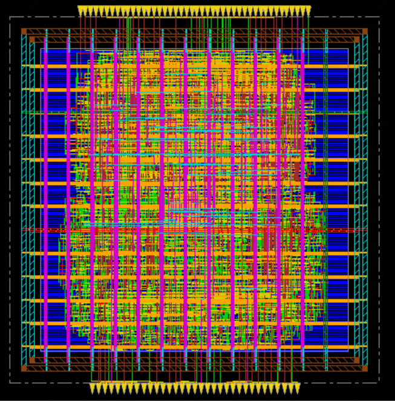

The placement screenshot shows a dense population of standard cells throughout the core.

The design does not contain a large macro floorplan, so the core is dominated by standard-cell logic and routing resources.

---

## 11.3 Placement Density

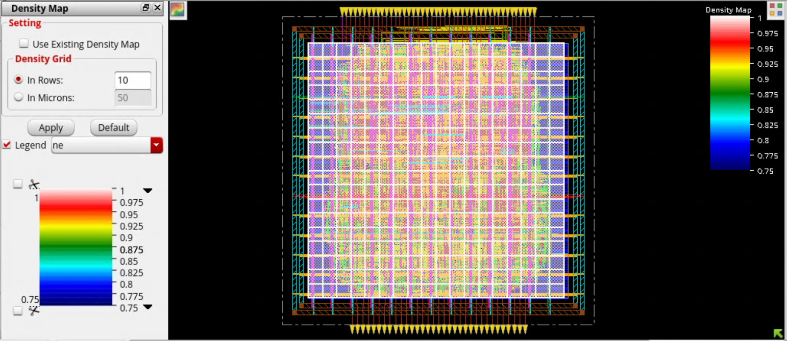

The density map visualizes how uniformly standard cells are distributed across the core.

The color scale allows regions with higher placement density to be identified.

A good placement should avoid excessively concentrated regions because high local density can cause:

```text
High local density
       ↓
Less routing space
       ↓
Congestion
       ↓
Longer detours / DRC risk
       ↓
Timing degradation
```

---

## 11.4 Congestion After Placement

The supplied congestion report gives:

```text
Horizontal routing usage = 10.1%
Vertical routing usage   = 8.2%

Horizontal overflow = 0
Vertical overflow   = 0
```

This indicates that the reported routing demand does not exceed the available routing capacity in the analyzed congestion model.

---

# 12. Pre-CTS Optimization

Pre-CTS optimization is performed after placement and before the clock tree is physically built.

At this stage, the clock network is not yet represented by its final routed clock tree.

The objective is to improve the data-path implementation before CTS.

Typical optimization targets include:

- Setup timing.
- Hold feasibility.
- Slew.
- Capacitance.
- Fanout.
- Cell sizing.
- Buffer insertion.
- Placement refinement.
- Congestion.

The basic concept is:

```text
Placement
   ↓
Pre-CTS Optimization
   ↓
Better data-path quality
   ↓
CTS
```

---

## 12.1 Why Pre-CTS Optimization Matters

If the data paths are already poor before CTS, the clock tree cannot automatically solve all timing problems.

For example:

```text
Long data path
     ↓
Large delay
     ↓
Poor setup slack
```

The optimizer may:

- Upsize cells.
- Insert buffers.
- Change cell topology where allowed.
- Improve placement.
- Reduce wirelength.

---

# 13. Clock Tree Synthesis

Clock Tree Synthesis creates the physical clock-distribution network.

The clock is different from an ordinary data signal because it drives a large number of sequential elements and must reach them with controlled timing relationships.

---

## 13.1 CTS Objectives

CTS attempts to control:

- Clock skew.
- Clock latency.
- Clock transition.
- Clock fanout.
- Clock-tree buffering.
- Clock power.
- Clock-tree routability.

The conceptual clock tree is:

```text
                    CLK
                     │
                 Root Buffer
                     │
          ┌──────────┴──────────┐
          │                     │
       Buffer                Buffer
          │                     │
      ┌───┴───┐             ┌───┴───┐
      │       │             │       │
    FFs      FFs           FFs      FFs
```

---

## 13.2 CTS Result

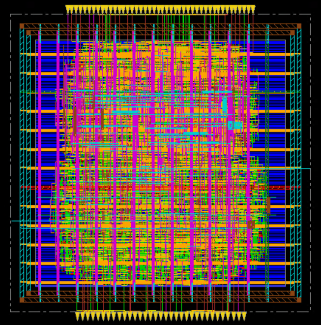

The CTS screenshot shows the clock-tree distribution after clock synthesis.

The design contains clock-tree buffering and clock-related physical structures inserted to distribute `clk123`.

---

## 13.3 Clock Tree Debugger

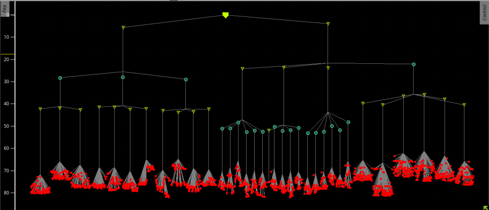

The clock-tree debugger provides a hierarchical view of clock propagation.

The supplied screenshot shows the clock network from its source through intermediate clock structures toward sequential endpoints.

This view is useful for investigating:

- Clock fanout.
- Clock-tree depth.
- Clock buffer distribution.
- Clock paths.
- Clock endpoint connectivity.

---

## 13.4 Clock Period

The reported clock period is:

```text
600 ps
```

Equivalent frequency:

```text
~1.667 GHz
```

---

# 14. Routing

Routing converts logical connections into physical metal interconnect.

The routing stage generally consists of:

```text
Placement
   ↓
CTS
   ↓
Global Routing
   ↓
Detailed Routing
   ↓
Post-route extraction / analysis
```

---

## 14.1 Routing Objectives

The routing stage should:

- Connect all required nets.
- Respect technology design rules.
- Minimize unnecessary detours.
- Control congestion.
- Maintain timing quality.
- Complete clock and data connectivity.
- Produce a physically realizable interconnect network.

---

## 14.2 Routed Design

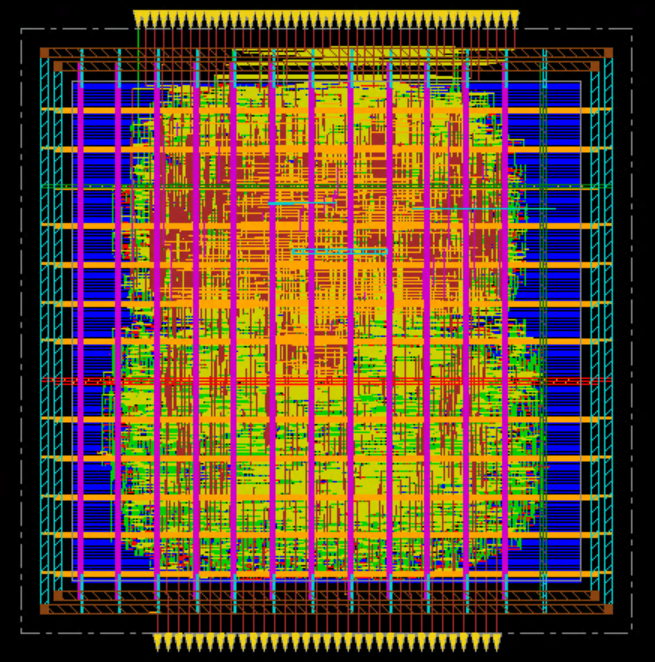

The final routing view shows the dense metal interconnect over the placed standard cells.

Different colors correspond to different physical layers and routing structures in the Innovus display.

---

## 14.3 Why Routing Changes Timing

Before routing, the tool uses estimated interconnect information.

After routing, the actual physical interconnect contributes:

- Resistance.
- Capacitance.
- RC delay.
- Coupling effects where modeled.
- Transition degradation.

Therefore post-route timing is more representative of the final physical implementation than early placement timing.

---

# 15. Post-Route Setup Timing

Setup timing checks whether data launched from a sequential element can reach the receiving endpoint before the capture edge.

The supplied setup report shows:

```text
Startpoint : address[1]
Endpoint   : read_data[4]

Clock      : clk123
Clock period : 600 ps

Arrival time  = 600.000 ps
Required time = 449.950 ps
Data path     = 387.200 ps
Slack         = +62.750 ps
```

---

## 15.1 Setup WNS

The timing summary reports:

```text
Setup WNS = +62.750 ps
```

WNS means:

**Worst Negative Slack**

A positive WNS means the worst analyzed setup path has positive timing margin.

---

## 15.2 Setup TNS

The timing summary reports:

```text
Setup TNS = 0.000 ps
```

TNS means:

**Total Negative Slack**

Since the TNS is zero, the reported setup analysis has no negative-slack contribution.

---

## 15.3 Setup Timing Map

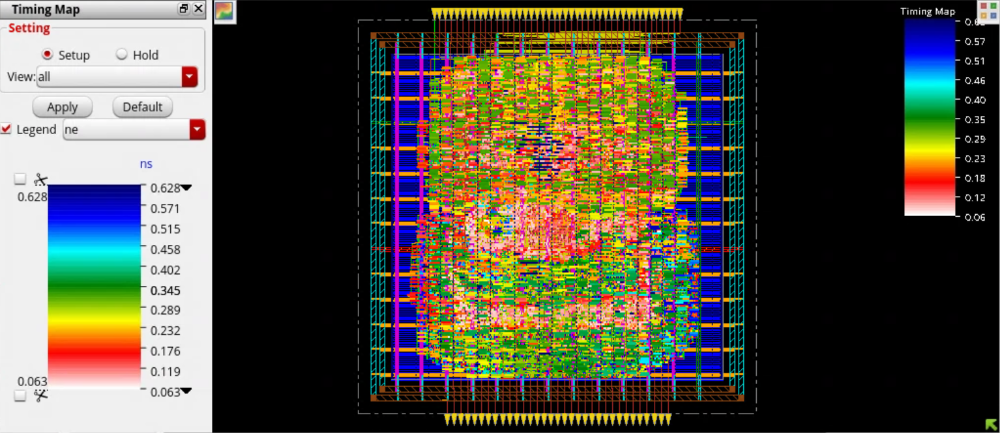

The setup timing map provides a physical visualization of timing values across the design.

This helps identify spatial regions where timing paths have relatively larger or smaller delay values.

---

## 15.4 Setup Timing Report

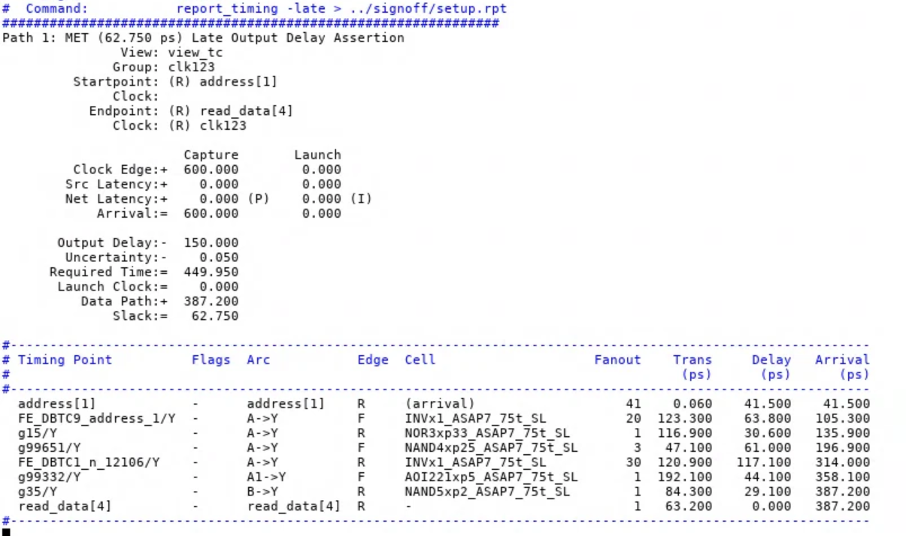

The detailed path contains multiple logic cells and associated delays.

The final reported slack is:

```text
+62.750 ps
```

---

# 16. Post-Route Hold Timing

Hold timing checks whether the launched data arrives sufficiently late relative to the receiving flip-flop's hold requirement.

The supplied hold report shows:

```text
Startpoint : write_data[16]
Endpoint   : block_reg_reg[5][16]/D

Hold slack = +0.372 ps
```

---

## 16.1 Why Hold Is Different from Setup

Setup is primarily concerned with data being **too late**.

Hold is primarily concerned with data being **too early**.

```text
Setup:
Launch ────────────────► Capture
             data must arrive
             before deadline

Hold:
Launch ─────► Capture
       data must remain stable
       for required hold interval
```

---

## 16.2 Hold Result

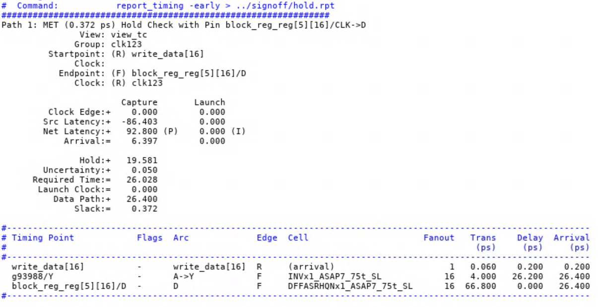

The reported path has:

```text
Hold slack = +0.372 ps
```

The margin is positive but small, so this path is relatively close to the hold boundary.

---

## 16.3 Hold Timing Map

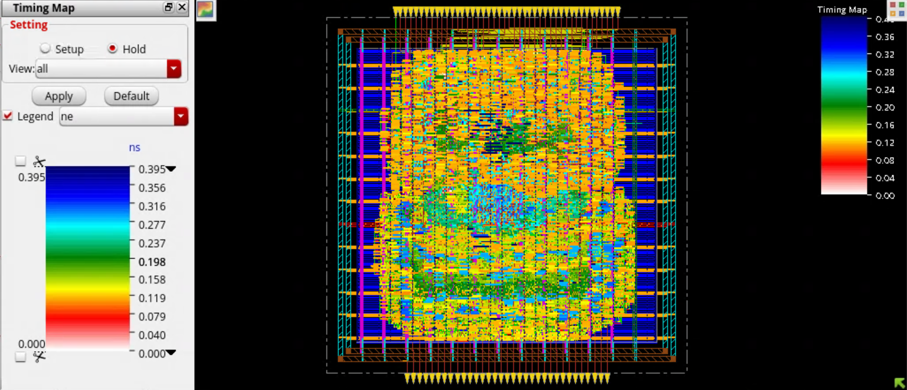

The hold timing map provides a spatial visualization of the analyzed hold timing values.

---

# 17. Timing Summary

The supplied Innovus timing summary reports:

### Setup

```text
View : ALL

WNS = +62.750 ps
TNS = 0.000 ps
FEP = 0
```

The `ABC` group shows:

```text
WNS = +82.300 ps
TNS = 0.000 ps
FEP = 0
```

The default group shows:

```text
WNS = +62.750 ps
TNS = 0.000 ps
FEP = 0
```

---

## Timing Summary Table

| Metric | Result |
|---|---:|
| Clock period | 600 ps |
| Target frequency | ~1.667 GHz |
| Setup WNS | +62.750 ps |
| Setup TNS | 0 ps |
| Setup FEP | 0 |
| Reported hold slack | +0.372 ps |

---

# 18. Timing Checks and Constraint Warnings

The supplied `check_timing` report contains:

| Warning | Count |
|---|---:|
| `ideal_clock_waveform` | 1 |
| `no_drive` | 44 |
| `no_input_delay` | 43 |

---

## 18.1 `ideal_clock_waveform`

This indicates that the clock waveform is being treated as ideal in the relevant timing context.

An ideal clock does not represent the physical clock-tree insertion and propagation that occurs after CTS.

The final timing analysis should therefore be interpreted together with the post-CTS/post-route clock model actually used.

---

## 18.2 `no_drive`

The `no_drive` warnings indicate that certain inputs do not have an explicitly modeled driving-cell condition.

Input drive strength affects:

- Input transition.
- Cell delay.
- Slew.
- Downstream timing.

For production-quality constraints, these warnings should be reviewed.

---

## 18.3 `no_input_delay`

The `no_input_delay` warnings indicate that some inputs do not have an explicit input-delay constraint relative to a clock.

Input delay defines when external data is assumed to become available at the design boundary.

Missing input delays can make timing analysis incomplete for those interfaces.

---

## 18.4 Professional Interpretation

These warnings should **not** simply be removed from the project report.

A better engineering statement is:

> The supplied timing-check report contains `no_drive` and `no_input_delay` warnings. These constraints should be reviewed and completed before claiming fully constrained production signoff.

This is more credible than claiming all signoff checks are clean.

---

# 19. Congestion Analysis

Congestion analysis estimates routing demand versus available routing resources.

The supplied report shows:

```text
Usage:
Horizontal = 10.1%
Vertical   = 8.2%
```

Overflow:

```text
Horizontal = 0
Vertical   = 0
```

---

## 19.1 Congestion Distribution

The report gives:

```text
Remaining bins with high congestion:
Horizontal:
  1 : 0.01%
  2 : 0.01%
  3 : 0.08%
  4 : 0.17%
  5 : 99.72%

Vertical:
  1 : 0.00%
  2 : 0.00%
  3 : 0.00%
  4 : 0.00%
  5 : 99.99%
```

The report also states:

```text
Normalized maximum congestion hotspot area = 0.00
Normalized total congestion hotspot area  = 0.00
```

---

## 19.2 Interpretation

The key result is:

```text
No routing overflow
```

This indicates that the analyzed routing demand remains within the available capacity.

Low reported congestion is beneficial because it reduces the probability of:

- Routing detours.
- Unrouted nets.
- DRC issues caused by routing demand.
- Excessive wirelength.
- Timing degradation caused by congestion.

---

## 19.3 Congestion Report

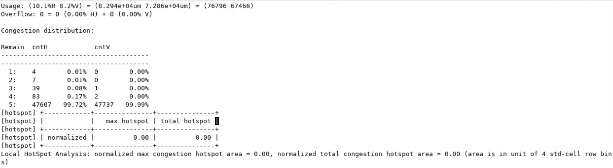

---

# 20. Area Analysis

The supplied area report shows:

```text
Design                : sha256
Standard-cell count   : 8,309
Total area            : 20,172.655 µm²
```

The area is distributed across cell categories including:

- Buffers.
- Inverters.
- Combinational logic.
- Flip-flops.
- Clock-gating cells.
- Physical-only cells.

The report contains no macros in the displayed macro-area field.

---

## 20.1 Why Area Matters

Area affects:

- Die size.
- Cost.
- Routing resources.
- Power distribution.
- Wirelength.
- Timing.
- Manufacturing efficiency.

Increasing area can sometimes improve timing and congestion by providing more placement/routing space, but it can also increase die size and power.

---

## 20.2 Area Report

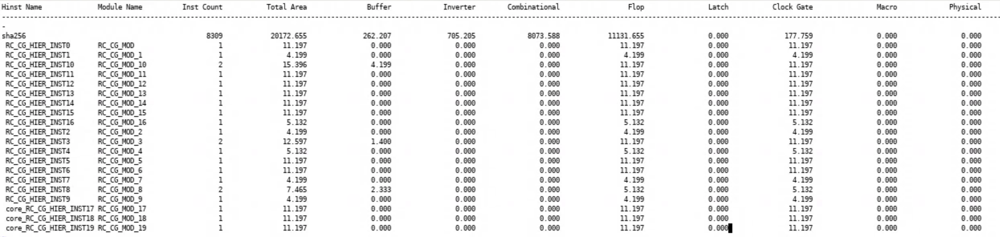

---

# 21. Power Analysis

The supplied Innovus `report_power` result gives:

```text
Total Internal Power  = 4.17627025 mW
Total Switching Power = 2.71907241 mW
Total Leakage Power   = 0.11019731 mW
Total Power           = 7.00553994 mW
```

---

## 21.1 Power Breakdown

| Category | Internal | Switching | Leakage | Total |
|---|---:|---:|---:|---:|
| Sequential | 2.115 mW | 0.3163 mW | 0.05169 mW | 2.483 mW |
| Combinational | 1.829 mW | 1.996 mW | 0.05418 mW | 3.879 mW |
| Clock (Combinational) | 0.1895 mW | 0.3933 mW | 0.002414 mW | 0.5852 mW |
| Clock (Sequential) | 0.04292 mW | 0.01372 mW | 0.001431 mW | 0.05808 mW |
| Physical-only | 0 | 0 | 0.000483 mW | 0.000483 mW |
| **Total** | **4.176 mW** | **2.719 mW** | **0.1102 mW** | **7.006 mW** |

---

## 21.2 Internal Power

Internal power is associated with energy dissipated inside cells due to internal capacitances and transistor switching behavior.

Reported value:

```text
4.17627025 mW
```

Percentage of total:

```text
59.6138%
```

---

## 21.3 Switching Power

Switching power is associated primarily with charging and discharging external net capacitances.

Reported value:

```text
2.71907241 mW
```

Percentage:

```text
38.8132%
```

---

## 21.4 Leakage Power

Leakage is consumed even when the circuit is not actively switching.

Reported value:

```text
0.11019731 mW
```

Percentage:

```text
1.5730%
```

---

## 21.5 Total Power

```text
Total power = 7.00553994 mW
```

Rounded:

```text
≈ 7.006 mW
```

---

## 21.6 Power Report

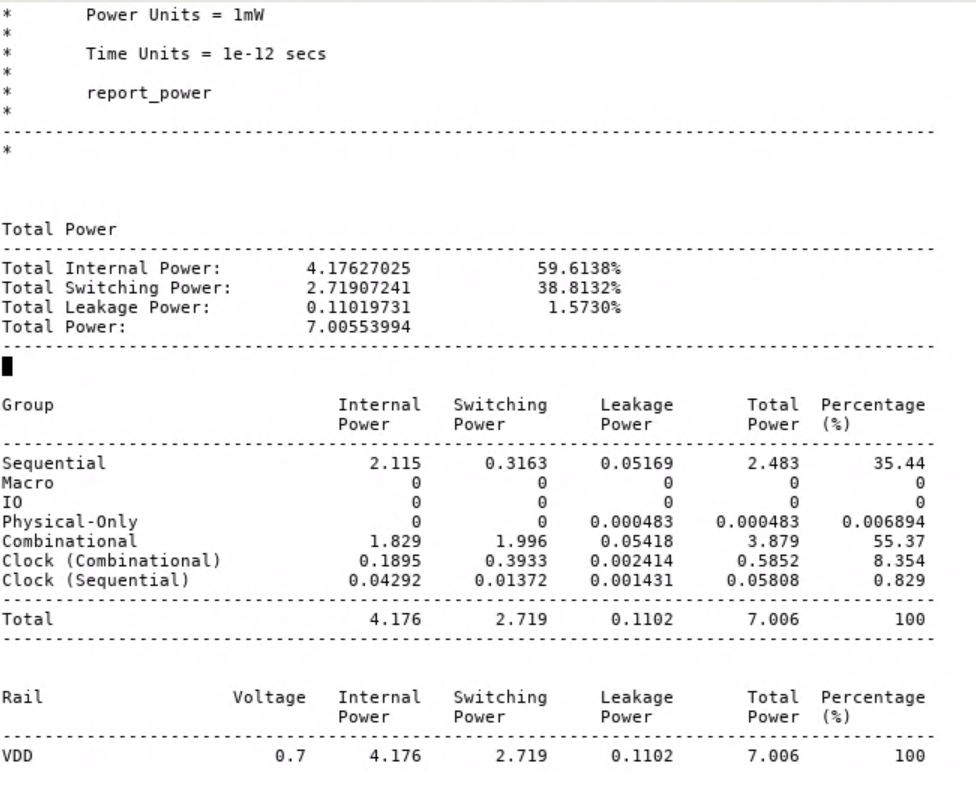

---

# 22. Leakage Power Analysis

The dedicated leakage report gives:

```text
Total Leakage Power = 0.11019731 mW
```

The main contributors are:

```text
Sequential     = 0.05169 mW
Combinational  = 0.05418 mW
```

Their percentages are approximately:

```text
Sequential     = 46.91%
Combinational  = 49.16%
```

---

## 22.1 Leakage by Library

The supplied report shows leakage contributions from multiple ASAP7 libraries, including:

- `asap7sc7p5t_SE0_SVLT_TT_nldm_220123`
- `asap7sc7p5t_AO_LVT_TT_nldm_211120`
- `asap7sc7p5t_SIMPLE_LVT_TT_nldm_211120`
- `asap7sc7p5t_SIMPLE_SVLT_TT_nldm_211120`
- `asap7sc7p5t_OA_LVT_TT_nldm_211120`
- `asap7sc7p5t_OA_SVLT_TT_nldm_211120`
- `asap7sc7p5t_INVBUF_LVT_TT_nldm_211120`
- `asap7sc7p5t_INVBUF_SVLT_TT_nldm_211120`

This demonstrates that leakage is influenced by the actual cell types and threshold-voltage variants used by the implementation.

---

## 22.2 Leakage Report

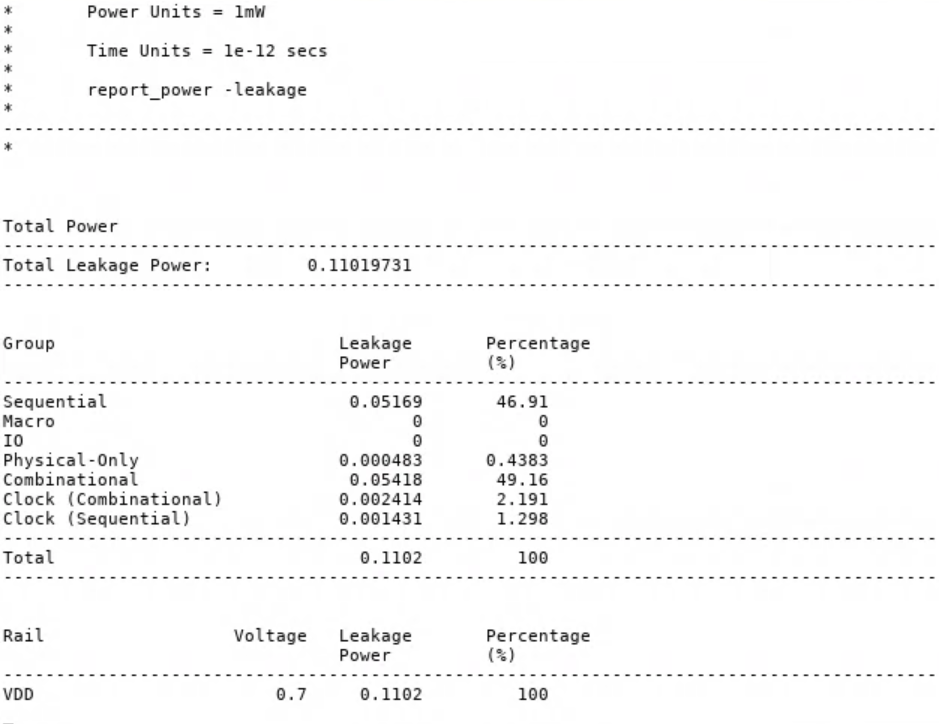

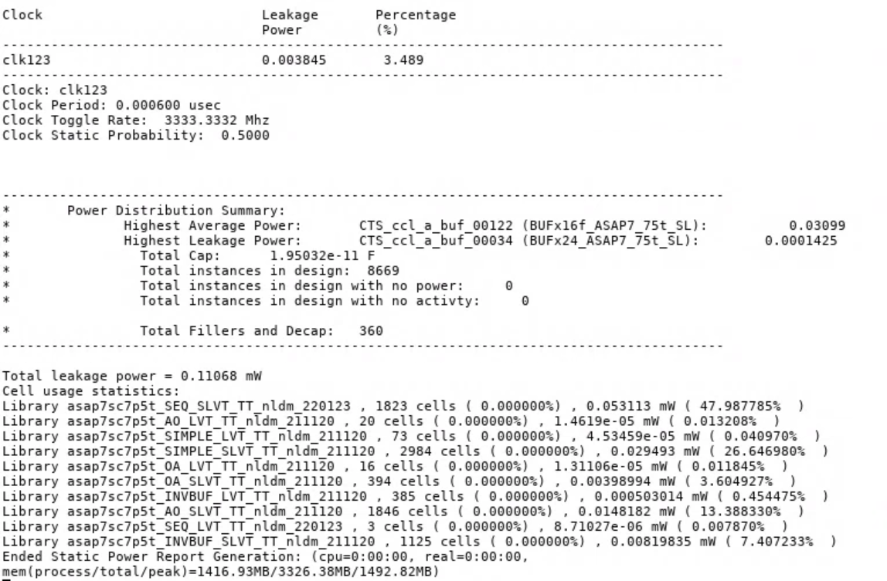

---

# 23. Clock Power

The clock-specific power report gives:

```text
Clock : clk123

Internal power  = 0.2324 mW
Switching power = 0.4071 mW
Leakage power   = 0.003845 mW
Total power     = 0.6433 mW
```

Clock power percentage:

```text
9.183%
```

The report also gives:

```text
Clock period        = 0.000600 usec
Clock toggle rate   = 3333.3332 MHz
Clock static prob.  = 0.5000
```

The clock tree therefore represents a significant part of the total dynamic power budget.

---

## Why Clock Power Matters

The clock is continuously distributed to many sequential elements.

Therefore:

```text
Large fanout
    +
Clock capacitance
    +
High switching activity
    ↓
Significant dynamic power
```

This is one reason CTS must consider power as well as skew and latency.

---

# 24. Design Statistics

The supplied design/area report shows:

```text
Standard-cell instances = 8,309
Total area              = 20,172.655 µm²
```

The broader power report reports:

```text
Total instances in design = 8,669
Total fillers and decap   = 360
```

The difference is important:

```text
8,309 reported design cells
+
360 fillers/decap
=
8,669 total instances
```

Therefore the two numbers should not be presented as contradictory. They represent different reporting categories.

---

# 25. Physical Design Stage Summary

| Stage | Main Objective | Evidence / Result |
|---|---|---|
| Initialization | Load design, libraries and constraints | SHA-256 design loaded |
| Floorplan | Define die/core and I/O | 60.7598% utilization |
| Power Planning | Build VDD/VSS network | Power-grid view |
| Placement | Place standard cells | Placement + density maps |
| Pre-CTS | Improve data-path quality | Pre-CTS stage |
| CTS | Build clock network | Clock-tree view/debugger |
| Routing | Connect all physical nets | Routed layout |
| Setup | Check late data arrival | +62.750 ps WNS |
| Hold | Check early data arrival | +0.372 ps reported slack |
| Congestion | Check routing demand | 0 H/V overflow |
| Area | Measure cell area | 20,172.655 µm² |
| Power | Analyze consumption | 7.006 mW |
| Leakage | Analyze static power | 0.1102 mW |
| Timing checks | Validate constraints | Warnings require review |

---

# 26. Final Implementation Results

## Physical

```text
Technology       : ASAP7
Core utilization : 60.7598%
Cell area        : 20,172.655 µm²
Standard cells   : 8,309
```

## Timing

```text
Clock period : 600 ps
Frequency    : ~1.667 GHz

Setup WNS : +62.750 ps
Setup TNS : 0 ps

Hold slack shown : +0.372 ps
```

## Congestion

```text
Horizontal usage : 10.1%
Vertical usage   : 8.2%

Horizontal overflow : 0
Vertical overflow   : 0
```

## Power

```text
Internal power  : 4.1763 mW
Switching power : 2.7191 mW
Leakage power   : 0.1102 mW
Total power     : 7.0055 mW
```

---

# 27. Challenges and Debugging

Physical-design implementation is an iterative process. The major debugging categories relevant to this project include:

## 27.1 Timing

When timing is poor, investigate:

```text
Slack
 ↓
Critical path
 ↓
Cell delay
 ↓
Net delay
 ↓
Transition
 ↓
Fanout
 ↓
Placement
 ↓
Clock latency/skew
```

Possible fixes include:

- Cell upsizing.
- Buffer insertion.
- Placement optimization.
- Reducing wirelength.
- Improving clock-tree balance.
- Reducing fanout.
- Reviewing constraints.

---

## 27.2 Congestion

When congestion is high:

```text
Congestion
    ↓
Identify hotspot
    ↓
Check placement density
    ↓
Check pin density
    ↓
Check routing resources
    ↓
Optimize placement/floorplan
```

Typical fixes include:

- Reducing utilization.
- Increasing core area.
- Improving pin distribution.
- Spreading cells.
- Adding routing resources where appropriate.
- Optimizing placement.

In the supplied report, the final congestion analysis shows **zero overflow**, so no congestion-overflow fix is claimed for this run.

---

## 27.3 Hold Timing

The reported hold slack is positive but small:

```text
+0.372 ps
```

Hold is particularly sensitive to:

- Clock skew.
- Clock latency.
- Minimum data-path delay.
- Buffer insertion.
- Routing changes.

Typical hold repair methods include:

- Adding delay cells.
- Inserting buffers.
- Increasing data-path delay.
- Clock-tree optimization.

---

## 27.4 Timing Constraint Warnings

The supplied `check_timing` output includes:

```text
no_drive      : 44
no_input_delay: 43
```

These should be addressed in a production-quality constraint environment.

---

# 28. Tcl / Innovus Implementation

The repository includes stage-wise Tcl templates.

## Floorplan

Typical command structure:

```tcl
floorPlan ...
```

The actual dimensions used by the run were:

```text
Core : 197.424 × 194.400 µm
Die  : 237.456 × 234.576 µm
```

---

## Placement

Typical flow:

```tcl
place_design
place_opt_design
```

Then:

```tcl
report_congestion
```

---

## CTS

Typical flow:

```tcl
create_ccopt_clock_tree_spec
ccopt_design
```

The exact commands/options can differ with the Innovus release and setup.

---

## Routing

Typical flow:

```tcl
routeDesign
```

Then timing and congestion are checked again.

---

## Timing

```tcl
report_timing -late
report_timing -early
report_timing_summary
check_timing
```

---

## Power

```tcl
report_power
report_power -leakage
```

---

## Saving the Design

```tcl
saveDesign ./outputs/sha256_final.enc
```

The actual path depends on the local project setup.

---

# 29. Report Generation

The following reports are useful for a professional physical-design project.

## Timing

```tcl
report_timing -late
report_timing -early
report_timing_summary
check_timing
```

## Power

```tcl
report_power
report_power -leakage
```

## Physical

```tcl
report_congestion
```

The exact area command depends on the Innovus version and database/reporting setup.

---

# 30. Project Structure

```text
ASAP7-DTOP-Physical-Design/
│
├── README.md
├── README2.md
│
├── constraints/
│   └── clk123.sdc
│
├── scripts/
│   ├── 00_init.tcl
│   ├── 01_floorplan.tcl
│   ├── 02_powerplan.tcl
│   ├── 03_placement.tcl
│   ├── 04_prects_opt.tcl
│   ├── 05_cts.tcl
│   ├── 06_routing.tcl
│   ├── 07_timing.tcl
│   ├── 08_power.tcl
│   └── 09_signoff.tcl
│
├── reports/
│   ├── timing/
│   ├── power/
│   └── physical/
│
├── screenshots/
│   ├── 01_floorplan/
│   ├── 02_powerplanning/
│   ├── 03_placement/
│   ├── 04_prects/
│   ├── 05_cts/
│   ├── 06_routing/
│   ├── 07_timing_analysis/
│   ├── 08_power_analysis/
│   └── 09_design_statistics/
│
└── docs/
    ├── flow_overview.md
    ├── timing_analysis.md
    ├── power_analysis.md
    └── interview_notes.md
```

---

# 31. Skills Demonstrated

This project demonstrates practical exposure to:

### Physical Design

- Floorplanning.
- I/O placement.
- Power planning.
- Standard-cell placement.
- Placement optimization.
- CTS.
- Routing.
- Post-route analysis.

### Timing

- SDC concepts.
- Setup analysis.
- Hold analysis.
- WNS.
- TNS.
- Slack.
- Clock timing.
- Timing-check debugging.

### Physical Analysis

- Placement density.
- Routing congestion.
- Overflow.
- Cell area.
- Design statistics.

### Power

- Internal power.
- Switching power.
- Leakage power.
- Clock power.
- Power distribution analysis.

### Scripting

- Tcl.
- Innovus command scripting.
- Automated report generation.
- Stage-wise implementation scripts.

---

# 32. What the Results Mean

## Positive Setup WNS

```text
+62.750 ps
```

means the worst reported setup path has a positive margin.

---

## Zero Setup TNS

```text
0 ps
```

means there is no negative setup slack accumulated in the reported summary.

---

## Positive Hold Slack

```text
+0.372 ps
```

means the reported hold path meets its requirement, although the margin is small.

---

## Zero Routing Overflow

```text
H overflow = 0
V overflow = 0
```

means the analyzed congestion model does not show routing demand exceeding available capacity.

---

## Total Power

```text
7.006 mW
```

is the reported total power under the assumptions of the Innovus power-analysis environment.

---

# 33. Interview Questions

A recruiter or physical-design interviewer can ask:

### Floorplan

**Q: Why did you use approximately 60.76% utilization?**

A: It provides enough placement area and routing resources while avoiding excessive cell density. Higher utilization can reduce area but can increase congestion and make timing/routing closure harder.

**Q: What is the difference between core area and die area?**

A: The core contains the standard-cell placement region. The die includes the core plus the peripheral area required for I/O, power structures and physical margins.

---

### Power Planning

**Q: Why do we need power rings and stripes?**

A: They create a low-resistance VDD/VSS distribution network so standard cells receive stable supply voltage and current can be delivered reliably across the core.

**Q: What happens if the PDN is weak?**

A: Resistance increases, which can cause IR drop and electromigration problems and may degrade cell performance.

---

### Placement

**Q: What happens if placement density is too high?**

A: Routing resources become limited, increasing congestion and potentially causing routing failures, longer detours and timing degradation.

---

### CTS

**Q: Why do we need CTS?**

A: The clock must reach many sequential elements with controlled skew, latency, transition and fanout. CTS builds a buffered clock network to achieve this.

**Q: What is clock skew?**

A: The difference in clock arrival time between two clock endpoints.

---

### Setup

**Q: What does positive WNS mean?**

A: The worst setup path has positive timing margin and meets the setup requirement.

---

### Hold

**Q: Why is hold checked after CTS?**

A: Clock skew and clock latency introduced by the physical clock tree strongly affect the relative timing of launch and capture elements, so hold analysis becomes especially important after CTS.

---

### Congestion

**Q: What does zero overflow mean?**

A: The reported routing demand does not exceed the available routing capacity in the analyzed congestion model.

---

### Power

**Q: What is the difference between internal and switching power?**

A: Internal power is dissipated within the cell during internal transistor activity, while switching power is mainly associated with charging and discharging capacitances on nets.

---

### Timing Constraints

**Q: What does `no_input_delay` mean?**

A: An input does not have an explicitly specified arrival delay relative to the clock. This can make interface timing analysis incomplete.

**Q: Why shouldn't you ignore `no_drive` warnings?**

A: The input drive model affects input transition and therefore cell delay. Missing drive information can make timing analysis less representative.

---

# 34. Reproducibility

A fully reproducible run requires:

- Cadence Innovus installation.
- Appropriate license.
- ASAP7 technology files.
- Standard-cell LEF files.
- Liberty timing libraries.
- MMMC configuration.
- Gate-level netlist.
- SDC constraints.
- Appropriate RC/extraction technology data.
- Linux environment.

These technology and license-dependent files are intentionally not included in this public repository.

The included Tcl files document the methodology and report-generation structure.

---

# 35. Limitations

The supplied reports establish:

- Physical implementation views.
- Area statistics.
- Congestion statistics.
- Setup timing.
- Hold timing.
- Timing checks.
- Total power.
- Leakage power.

However, the supplied evidence does not establish a complete production signoff package containing every possible check.

Before claiming final tapeout-quality signoff, the following should be separately verified where applicable:

- DRC.
- LVS.
- Antenna.
- IR drop.
- Electromigration.
- Signal integrity / crosstalk.
- Complete clock checks.
- Complete timing constraints.
- Multi-corner / multi-mode signoff.
- Final extracted timing.

Therefore the project is described as **physical implementation and post-route analysis**, rather than unconditional production signoff.

---

# 36. Conclusion

This project demonstrates a practical ASIC backend implementation flow for a SHA-256 design using ASAP7 and Cadence Innovus.

The implementation progressed through:

```text
Floorplanning
      ↓
Power Planning
      ↓
Placement
      ↓
Pre-CTS Optimization
      ↓
Clock Tree Synthesis
      ↓
Routing
      ↓
Post-Route Timing
      ↓
Power / Area / Congestion Analysis
```

The supplied results demonstrate:

```text
Core utilization       = 60.7598%
Cell area              = 20,172.655 µm²
Setup WNS              = +62.750 ps
Setup TNS              = 0 ps
Reported hold slack    = +0.372 ps
Routing overflow       = 0 H / 0 V
Total power            = 7.00554 mW
Leakage power          = 0.110197 mW
```

The project also demonstrates the importance of constraint quality: the timing-check report contains `no_drive` and `no_input_delay` warnings that should be reviewed before claiming complete production signoff.

The primary learning outcome is understanding how **floorplan, placement, power distribution, clock-tree synthesis and routing interact with timing, power, area and congestion** in a modern ASIC physical-design flow.
